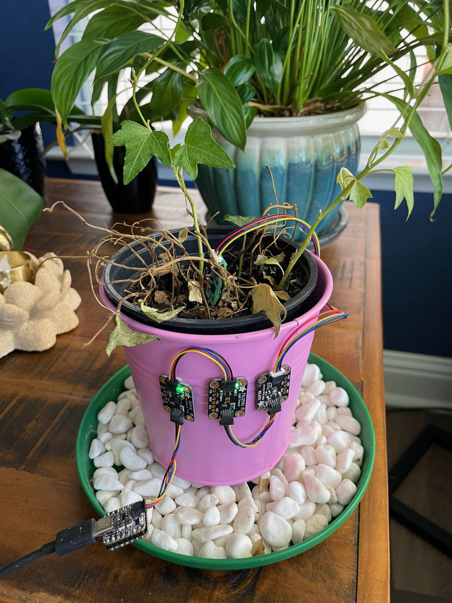
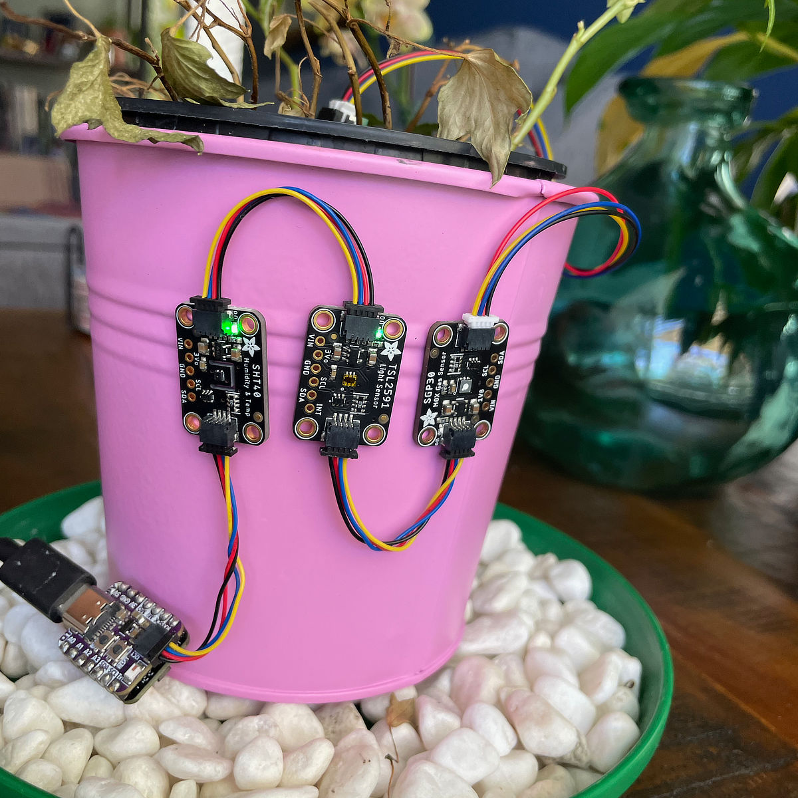
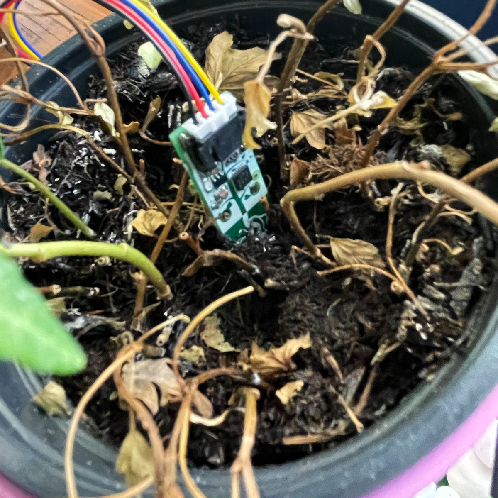

# Ivy Monitor

This sensor array, attatched to an Adafruit QT Py S2 monitors a plants environment:

- *SHT40:* temperature and humidity
- *Adaruit Soil Sensor:* soil moisture
- *TSL2591:* light
- *SGP30:* eCO2 (equivalent CO2) and TVOC (Total Organic Compounds)

Data is published on an MQTT broker in two intervals. Every 30 minutes all datapoints are sent. Every five miutes only eCO2 and TVOC are updated.

This data helps better understand the plants' needs and environment. It is recovering from not knowing how to care for it.

